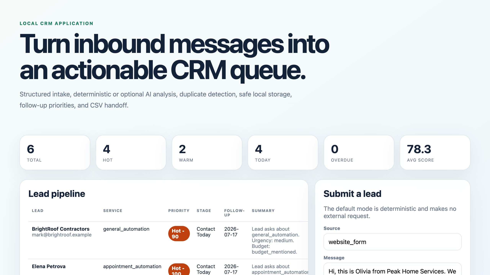

# AI CRM Lead Automation

[](https://github.com/bazhinapolly/ai-crm-lead-automation/actions/workflows/ci.yml)

A local-first application that turns inbound messages into structured CRM records, priorities, follow-up dates, and safe CSV exports. It works offline and at zero API cost by default; an optional OpenAI Responses API provider adds strict Structured Outputs without changing the CRM contract.

## What is implemented

- Validated `POST /api/intake` endpoint with body limits and safe error responses
- Deterministic service, urgency, budget, intent, and Hot/Warm/Cold scoring
- Optional OpenAI Responses API mode with strict JSON Schema and `store: false`
- Local contact extraction, duplicate detection, follow-up planning, and event logs
- Date-accurate today/overdue metrics that exclude closed and duplicate-review records
- Versioned single-file CRM state with interprocess locking and transactional lead-and-event replacement
- Safe legacy migration that removes old PII files only after a validated successful commit
- Optional local bearer/browser-session authentication with CSRF, sliding TTL, logout, and login throttling
- Thread-safe, bounded per-IP intake limiting plus a configurable cap on concurrent OpenAI calls
- Configurable contact retention plus export/delete-by-ID and explicit purge operations
- Raw lead messages excluded from storage unless explicitly enabled
- Best-effort PII redaction before OpenAI and local redaction of generated stored fields
- HTML escaping, constrained CSS classes, security headers, and CSV formula neutralization
- Responsive local dashboard, JSON endpoints, and CSV handoff
- 76 isolated tests, 90% coverage enforcement, and CI on Python 3.11, 3.12, and 3.13

## Local quick start

Requires Python 3.11 or newer on macOS or Linux. The application itself has no third-party runtime dependencies; it uses the standard-library/OS `flock` interface for interprocess state protection.

```bash
python3 src/seed_data.py --reset
python3 src/app.py
```

`--reset` is intentionally destructive: it clears existing local CRM state before loading the synthetic portfolio records. Without `--reset`, the seed command refuses to overwrite nonempty state and safely seeds an empty store.

Open <http://127.0.0.1:8080>. Use `PORT=8090 python3 src/app.py` if port 8080 is busy.



The screenshot is generated from deterministic mode with the repository's fictional seed records; it is not client data or evidence of a client deployment.

Runtime leads and logs are created under `data/` and ignored by Git. To keep local data elsewhere:

```bash
CRM_DATA_DIR=/tmp/crm-data python3 src/seed_data.py --reset
CRM_DATA_DIR=/tmp/crm-data python3 src/app.py
```

## Verify the project

```bash
python3 -m unittest discover -s tests -v
python3 tools/check_project.py --skip-pdf
```

To rebuild and validate the Upwork portfolio PDFs:

```bash
python3 -m pip install -r requirements-dev.txt
python3 tools/build_portfolio_pdfs.py
python3 tools/check_project.py
```

Final PDFs are written to [`output/pdf`](output/pdf). Temporary render files are not committed.

## API

```bash
curl http://127.0.0.1:8080/api/health

curl -X POST http://127.0.0.1:8080/api/intake \
  -H 'Content-Type: application/json' \
  -d '{"source":"website_form","message":"Hi, this is Sarah from Oakwood Dental. We need appointment automation urgently. Budget is $1500. Email sarah@example.com."}'
```

| Method | Route | Purpose |
|---|---|---|
| `GET` | `/` | Local CRM dashboard |
| `GET` | `/api/health` | Health and analysis mode |
| `GET` | `/api/leads` | Leads plus pipeline metrics |
| `GET` | `/api/leads/{id}` | Export one lead as JSON |
| `GET` | `/api/logs` | Automation event log |
| `POST` | `/api/intake` | Validate and classify one lead |
| `DELETE` | `/api/leads/{id}` | Delete one lead and record a metadata-only event |
| `POST` | `/api/maintenance/purge` | Purge contacts older than the configured retention window |
| `GET` | `/export/leads.csv` | Spreadsheet-safe CSV export |

CSV includes contact phone, owner, and suggested reply in addition to the scoring and follow-up fields.

## Local access and data lifecycle

Loopback binding remains the default boundary. Set a random `LOCAL_API_KEY` (at least 32 characters) when another local process or user must not read CRM data. API clients use `Authorization: Bearer ...`; browser users are redirected to a local sign-in form that creates an HttpOnly, SameSite session. Sessions use a configurable sliding TTL, logout clears both server state and cookie, failed sign-ins are throttled, and state-changing browser requests require a CSRF token. Authentication remains mandatory before adapting the application for any non-loopback or multiuser deployment.

Extracted contacts are retained locally until explicitly deleted or purged. `CONTACT_RETENTION_DAYS` defaults to 90 days. Run the following command to apply the policy; it records metadata-only purge events and does not include contact values in logs:

```bash
python3 src/purge_data.py
```

Every state transaction is protected across threads and independent processes. During a legacy upgrade, `leads.json` and `automation_logs.json` are deleted only after `crm_state.json` has been validated and atomically committed. Invalid or timezone-free `received_at` values stop startup/purge with a safe storage error instead of bypassing retention. Backup copies outside the CRM directory remain the operator's responsibility.

## Optional OpenAI mode

Export variables in your shell; this project deliberately does not auto-load `.env` files.

```bash
export USE_OPENAI=1
export OPENAI_API_KEY='your-key'
export OPENAI_MODEL='gpt-4o-mini-2024-07-18'
python3 src/app.py
```

Contact fields are extracted locally with conservative, case-sensitive name/company rules. Before an OpenAI request, detected high-confidence contacts plus email addresses, phone numbers, and long account-like numbers are best-effort redacted. Budget amounts and classification-relevant urgency/intent language are retained. Generated summaries and replies pass through the local redactor again before storage. Pattern-based processing is not an anonymization guarantee and must be evaluated against the target intake channel.

`POST /api/intake` has a bounded, thread-safe per-IP fixed-window limit in both modes. In OpenAI mode, `OPENAI_MAX_CONCURRENCY` additionally caps simultaneous provider calls; excess requests receive `429` with `Retry-After` instead of creating an unbounded paid queue. The in-memory controls are appropriate for this single-process local application; a multi-instance deployment requires a shared limiter.

The integration uses the [Responses API](https://developers.openai.com/api/reference/resources/responses/methods/create), [Structured Outputs](https://developers.openai.com/api/docs/guides/structured-outputs), `store: false`, strict local validation, bounded transient retries, and content-free provider logging. API keys, provider bodies, and lead text are never written to application logs. Separate OpenAI abuse-monitoring retention remains subject to the configured project's [data controls](https://developers.openai.com/api/docs/guides/your-data).

## Scoring policy and evaluation

Weights, service bonuses, and Hot/Warm/Cold thresholds live in [`config/scoring-policy.json`](config/scoring-policy.json). A balanced synthetic regression set and confusion-matrix evaluator are documented in [`docs/scoring-evaluation.md`](docs/scoring-evaluation.md). The checked deterministic policy result is 15/15; it demonstrates specification conformance, not real-world sales performance. Optional OpenAI evaluation requires the project owner's API key and does not claim an unverified score.

## Security and deployment boundary

This local-first application intentionally binds to a single machine and provides optional local authentication, browser sessions, CSRF controls, bounded intake/provider concurrency, and explicit contact lifecycle operations. Production rollout still requires mandatory identity and authorization, tenant isolation, TLS, a managed database, automated retention, distributed rate limiting, observability, backups, and the target CRM's official API. See [`docs/privacy-and-operations.md`](docs/privacy-and-operations.md).

The JSON API and CSV export are the implemented integration boundaries. Platform-specific Gmail, CRM, spreadsheet, and automation connectors are not implemented in this repository; a client adaptation selects one official API and adds its authentication, field mapping, idempotency, and reconciliation rules.

See the [Local Technical Verification Report](docs/local-technical-verification-report.md) for the verified release, date, environment scope, multiprocessing evidence, and exclusions. No client deployment or client acceptance is claimed.

## Project map

```text
src/                 local application, analysis, provider, and storage
config/              versioned lead-scoring policy
tests/               isolated unit and local HTTP integration tests
evaluations/         synthetic scoring regression cases
data/                sample inputs; runtime CRM files are ignored
docs/                case-study source and operating boundaries
tools/               PDF builder and repository checks
output/pdf/          final portfolio documents
.github/workflows/   multi-version CI and validated PDF rebuild
```

## License

[MIT](LICENSE) - Copyright 2026 Polina Bazhina.
