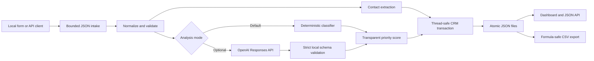

# Workflow Diagram

```mermaid
flowchart LR
  A["Local form or API client"] --> B["Bounded JSON intake"]
  B --> C["Normalize and validate"]
  C --> D["Contact extraction"]
  C --> E{"Analysis mode"}
  E -->|"Default"| F["Deterministic classifier"]
  E -->|"Optional"| G["OpenAI Responses API"]
  G --> H["Strict local schema validation"]
  F --> I["Transparent priority score"]
  H --> I
  D --> J["Thread-safe CRM transaction"]
  I --> J
  J --> K["Atomic JSON files"]
  K --> L["Dashboard and JSON API"]
  K --> M["Formula-safe CSV export"]
```

The committed project is intentionally local. External lead sources and production CRMs are adaptation points, not simulated live integrations.
