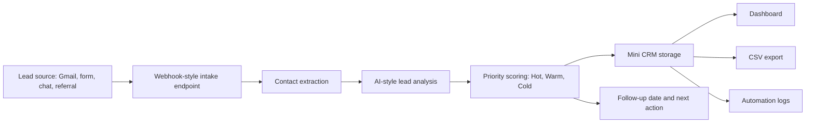

# Workflow Diagram

## Notes

The demo uses a local Python server and JSON storage, but the same workflow can be connected to HubSpot, GoHighLevel, Pipedrive, Airtable, Google Sheets, Zapier, Make, or n8n.
